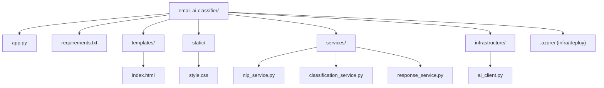
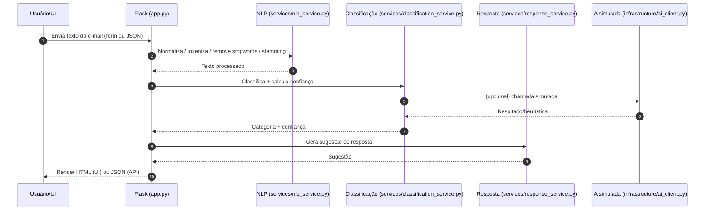

## Classificador de E-mail (IA) — Flask

Aplicação **Flask** que recebe o texto de um e-mail e retorna:

- **Categoria**: `Produtivo` ou `Improdutivo`
- **Confiança** (0–1)
- **Sugestão de resposta** (texto)

O objetivo é demonstrar uma solução simples com **UI (formulário)** + **API JSON**, com deploy no **Azure App Service** e testes via **Postman/curl**.

---

## Estrutura do projeto (visão geral)

- **`app.py`**: app Flask (rotas UI + API)
- **`templates/index.html`**: página do formulário
- **`static/style.css`**: estilos da UI
- **`services/`**: regras de NLP, classificação e resposta
- **`infrastructure/`**: integração/cliente de IA (simulada)
- **`requirements.txt`**: dependências

---

## Diagrama — estrutura de pastas

> Dica: o Mermaid renderiza automaticamente no GitHub e em muitos editores.



---

## Arquitetura (fluxo de processamento)



---

## Como executar localmente (Windows / PowerShell)

```powershell
python -m venv .venv
.\.venv\Scripts\Activate.ps1
pip install -r requirements.txt
python app.py
```

Acesse a UI em `http://127.0.0.1:5000`.

---

## Prova de teste local (CLI Azure OpenAI)

1. Configure variáveis de ambiente (PowerShell):

```powershell
$env:AZURE_OPENAI_ENDPOINT='https://eastus.api.cognitive.microsoft.com/'
$env:AZURE_OPENAI_API_KEY='SEU_API_KEY'
$env:AZURE_OPENAI_DEPLOYMENT='gpt-mini'
```

2. Execute o script de teste rápido:

```powershell
python teste.py
```

3. Teste uma pergunta e confirme a resposta do modelo:

```text
Digite sua pergunta (ou 'sair'): o que é o SOLID?
Resposta: SOLID é um acrônimo ...
```

Isso comprova que a aplicação está usando o Azure OpenAI com o endpoint e chave configurados.

---

## API JSON

- **Endpoint**: `POST /api/classify`
- **Body**:

```json
{ "email_text": "Olá, estamos com um bug crítico no sistema de pagamentos e precisamos de correção imediata." }
```

- **Resposta** (exemplo):

```json
{ "category": "Produtivo", "confidence": 0.87, "suggestion": "..." }
```

---

## Testes (Postman / curl)

### UI (formulário)

- `POST /` com `x-www-form-urlencoded`
  - campo: `email_text`
- Suporte de upload de arquivo: `.txt` ou `.pdf`
- A validação aceita apenas um método por envio: texto no campo ou arquivo anexado (não ambos simultaneamente)

### Exemplos de teste (mesmo padrão)

#### E-mail produtivo
- Texto: "Estamos com um problema de pagamentos recorrente e precisamos de correção urgente."
- Resultado esperado: `category: Produtivo` (confiança alta) + sugestão de resposta orientada à solução.

#### E-mail improdutivo
- Texto: "Obrigado pelo suporte, feliz em saber que está tudo certo."
- Resultado esperado: `category: Improdutivo` (confiança alta) + sugestão breve de agradecimento.

### API (JSON)

- `POST /api/classify`
  - header: `Content-Type: application/json`
  - body exemplo (produtivo):

```json
{ "email_text": "Há erro no processamento de pagamentos e precisamos de ação imediata" }
```

- body exemplo (improdutivo):

```json
{ "email_text": "Obrigado pelo retorno, está ótimo e sem urgência" }
```

- Resposta (exemplo):

```json
{ "category": "Produtivo", "confidence": 0.87, "suggestion": "..." }
```

---

## Deploy no Azure App Service (referência)

> Ajuste nomes/assinatura conforme seu ambiente.

> Observação: este fluxo de deploy é para quem tem conta no Azure e App Service configurado. Se você estiver em outro provedor (AWS, GCP, on-prem, etc.), use a estratégia de deploy específica desse ambiente (Docker + container registry, Kubernetes, serverless, etc.).

```powershell
az login
az group create -n email-ai-rg -l brazilsouth
az appservice plan create -n email-ai-plan -g email-ai-rg --sku B1 --is-linux
az webapp up -n email-ai-classifier-202603 -g email-ai-rg --plan email-ai-plan --runtime "PYTHON:3.11"
az webapp config set -g email-ai-rg -n email-ai-classifier-202603 --startup-file "gunicorn --bind=0.0.0.0 --timeout 120 app:app"
```

- **URL**: `https://email-ai-classifier-202603.azurewebsites.net`
